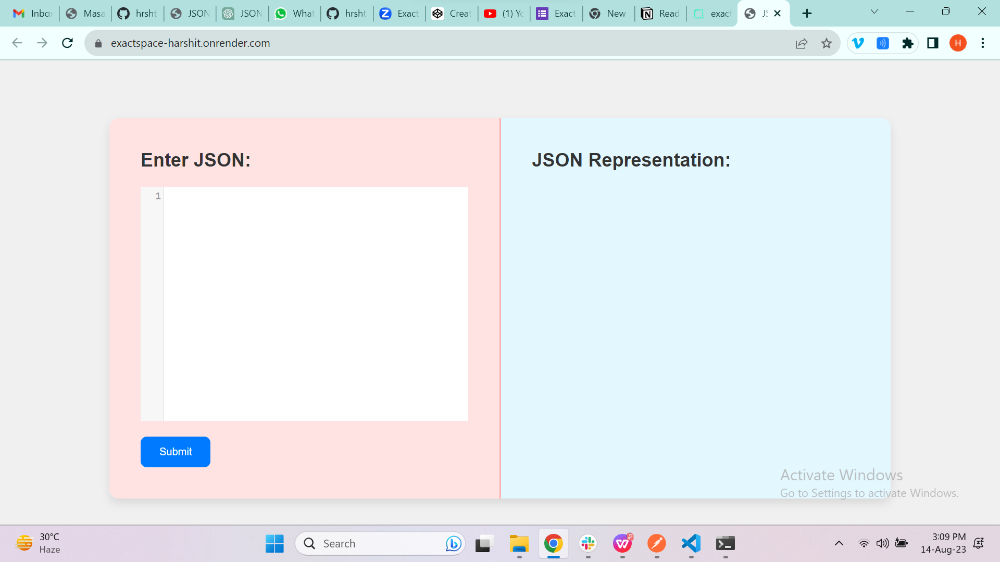
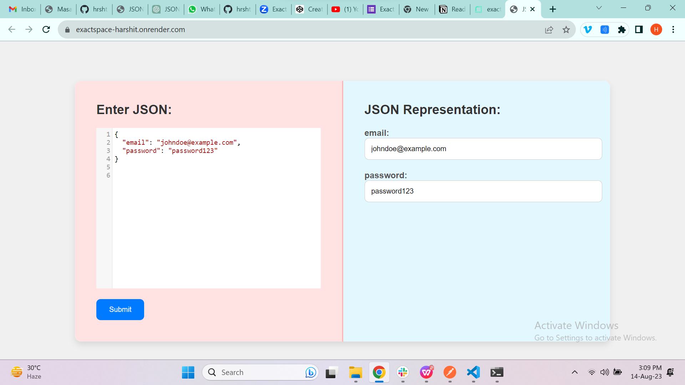
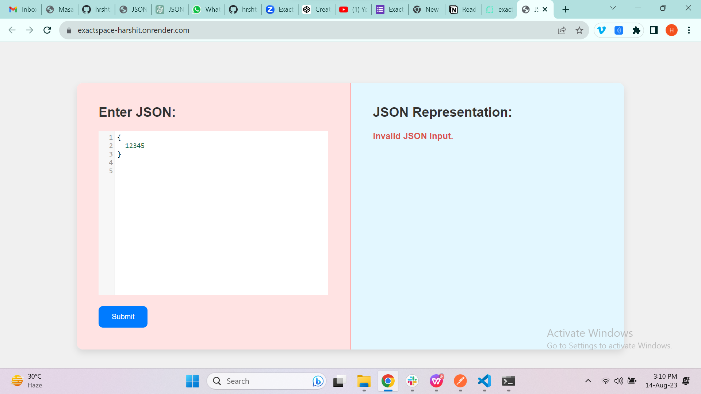

# Project Title
JSON Representation

## Introduction
Seamlessly manage JSON data. Input JSON, explore structured display. User-friendly design, vibrant visuals. Simplify JSON for all users. Ideal for API testing, data prototyping, and quick edits.

## Deplolyed App
https://exactspace-harshit.onrender.com/

## Video Walkthrough of the project
https://vimeo.com/854297732/c1e3b2fe4a

## Features

- Able to enter JSON data.
- Can detect if the data is JSON or not.
- Can turn data into fields and text fields.

## Installation & Getting started
Just enter the JSON data, to convert it into text fields.

## API Endpoints
POST / - posts the data.

## Technology Stack

- Node.js
- Express.js
- Codemirror